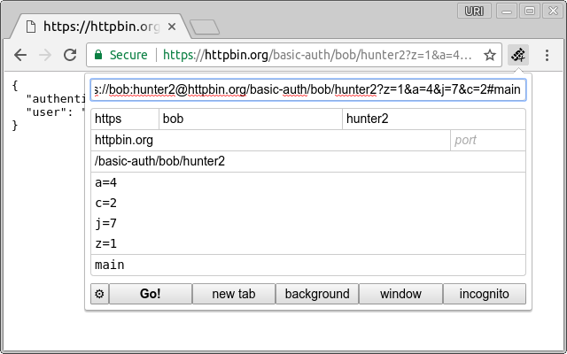
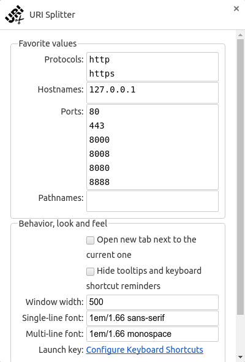

URI Splitter (Chrome extension)
===============================

 

Chrome extension to easily and quickly edit the URL/URI from the current page. [Get it on Chrome Web Store!][cws]

Features:

* Free and open-source.
* No (extra) permissions required.
* Keyboard shortcuts.
* Intuitive and easy-to-use.
* Customizable fonts.
* [Internationalized domain name][idn] support (thanks to [punycode.js][punycode] library)

How to use
----------

To activate the extension, just click on  or press `Ctrl+Shift+L` (or `⇧⌘L` on Mac). This shortcut has been chosen because it is similar to [the browser's shortcut to focus the location bar][chrome-shortcuts] (`Ctrl+L` or `⌘L`).

When the extension is activated, it will automatically focus and select the full URL inside the extension window. This means that, right away, the extension can give a feel similar to the browser location bar.

The extension window has two main regions: the full URL and the individual fields. Any changes done to the full URL will automatically reflect into the individual fields; and any changes on each field will automatically update the full URL.

After you have finished editing (or just viewing) the URL, you probably want to open it in the current tab, in a new tab, in a new background tab, in a new window, or in a new incognito window. All of these actions can also be done by keyboard, with shortcuts that mimic the basic browser behavior. The only exception is opening in the same window, which can be activated either by `Enter` or by `Alt+Enter`. This was done because `Enter` inserts a newline in multi-line fields.

If you forget the keyboard shortcuts, just press `Ctrl` or `Alt` or `⌘` and all the available shortcuts will be shown. Also, all single-letter shortcuts can be activated either by `Ctrl` (or `⌘`) or by `Alt`. This was implemented so that you can focus on using the extension, instead of trying to remember what keyboard modifier you have to use.

It is possible to tweak the behavior of the multi-line fields by going into the *quick options* (`⚙` button, or `Ctrl+O` or `⌘O`). The default settings should work for most cases, but the options are there in case they don't work for you. You can even set multiple characters as separators (in that case, the first character will be used for joining the lines when building the full URL).

History
-------

Sometime around 2012 or 2013, while working for Google, I felt the need for a quick, easy and error-proof way to edit parameters in URLs. Me, my team and other teams were spending too much time trying to find the exact parameter in the location bar (AKA address bar) in order to change its value. It was very annoying and time-consuming, specially when debugging, and even worse if accidentally the same parameter ended up twice in the URL.

Out of this need, I wrote the first version of *URI Splitter* and released it inside the company. Immediately, all my coworkers started using it.

In 2013, I left the company, and that version of the Chrome extension stayed there. I always wanted to release it to the public, but never got around doing it.

Fast-forward to 2017, I'm still editing URLs and I still can't find a good tool. Yet again, I see my coworkers going through similar trouble. That's when [MarkVozzo][] contacted me because he liked that extension so much that he wanted to use it outside Google. (And he's not even a developer! Heck, I also want to use it again!) This request prompted me to rebuild the extension from scratch, and [this repository right here][gh] is the result.

The code in this repository is a complete recreation of the Chrome extension I had built while working for Google. The code here was written from scratch, and now has more features than the older extension (which was — and still is — only available for Google employees).

FAQ
---

### URI? URL? What's the difference?

[URI][] is a more generic term than [URL][]. In practice, for the purposes of this project, they mean the same.

### How do I use username and password?

The *username* and *password* fields in this extension are part of the [URI syntax][syntax]. They can be used for [basic HTTP authentication][auth]. Most people will never use this, but sometimes developers need it for specific requests. If you are not sure you need it, then you don't need it, and you can ignore those fields.

It is worth noting that [Chrome 59][sr1] dropped support for [credentials in subrequests][sr2]. So, if you use *username*/*password* in the URL, pay attention to the [browser's developer console][console], because all subrequests (such as CSS, JavaScript or images) might be blocked.

### What's the relationship between this extension and Google

None.

### Isn't there an extension with the same name released inside Google?

Yes. I wrote that one too. Read more about it in *History*.

[cws]: https://chrome.google.com/webstore/detail/fdfikmgcjjhkdpejagohhojbopclfckn
[MarkVozzo]: https://twitter.com/MarkVozzo
[gh]: https://github.com/denilsonsa/crx-uri-splitter/
[idn]: https://en.wikipedia.org/wiki/Internationalized_domain_name
[punycode]: https://github.com/bestiejs/punycode.js/tree/v1.4.1
[chrome-shortcuts]: https://support.google.com/chrome/answer/157179
[URI]: https://en.wikipedia.org/wiki/Uniform_Resource_Identifier
[URL]: https://en.wikipedia.org/wiki/URL
[syntax]: https://en.wikipedia.org/wiki/Uniform_Resource_Identifier#Syntax
[auth]: https://en.wikipedia.org/wiki/Basic_access_authentication
[sr1]: https://www.chromestatus.com/feature/5669008342777856
[sr2]: https://groups.google.com/a/chromium.org/d/msg/blink-dev/lx-U_JR2BF0/Hsg1fiZiBAAJ
[console]: https://developers.google.com/web/tools/chrome-devtools/console/
